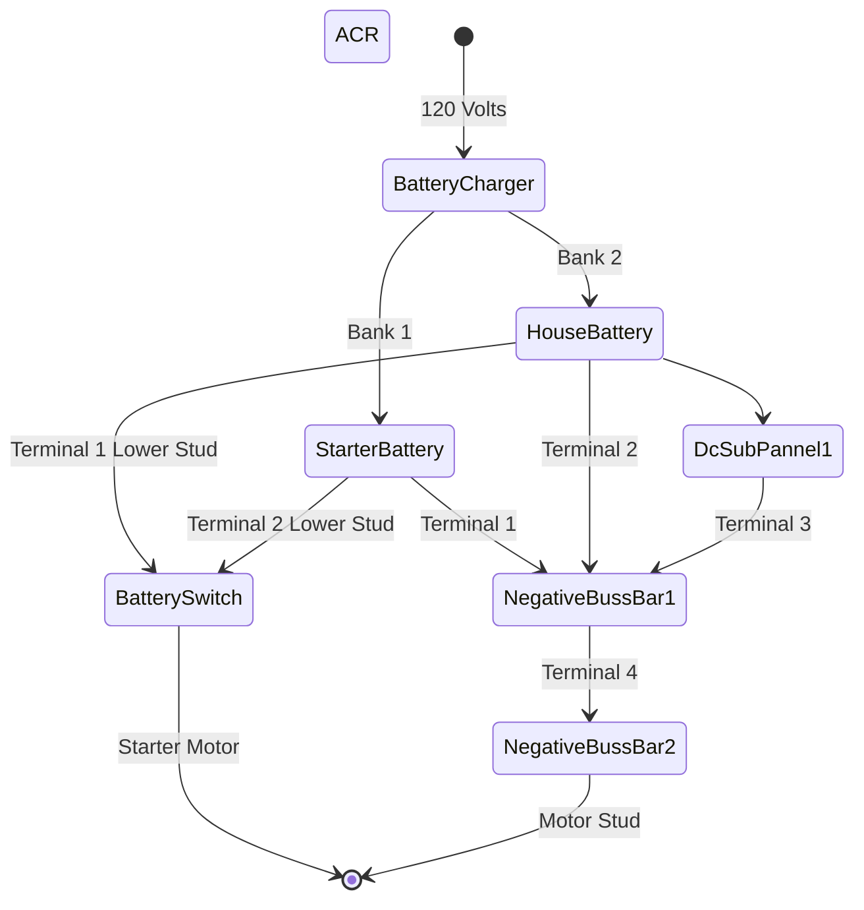

# boat-wiring-diagram

```mermaid
stateDiagram
    
    BatteryCharger %% ProMariner 44012 ProSport HD Waterproof Marine Battery Charger, 12 Amp, 2 Bank
    DcSubPannel1 %% Blue Sea Systems 5025 ST Blade Fuse Block 6 Circuit with Ground and Cover
    ACR
    BatterySwitch

    StarterBattery
    HouseBattery

    NegativeBussBar1 %% Blue Sea System 2127 MaxiBus BusBar 
    NegativeBussBar2
     

    [*] --> BatteryCharger: 120 Volts

    BatteryCharger --> StarterBattery: Bank 1
    BatteryCharger --> HouseBattery: Bank 2

    HouseBattery --> BatterySwitch: Terminal 1 Lower Stud
    StarterBattery --> BatterySwitch: Terminal 2 Lower Stud
    BatterySwitch --> [*]: Starter Motor

    HouseBattery --> DcSubPannel1

    StarterBattery --> NegativeBussBar1: Terminal 1
    HouseBattery --> NegativeBussBar1: Terminal 2
    DcSubPannel1 --> NegativeBussBar1: Terminal 3
    NegativeBussBar1 --> NegativeBussBar2: Terminal 4

    NegativeBussBar2 --> [*] : Motor Stud

```